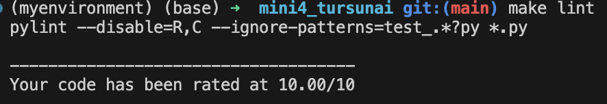
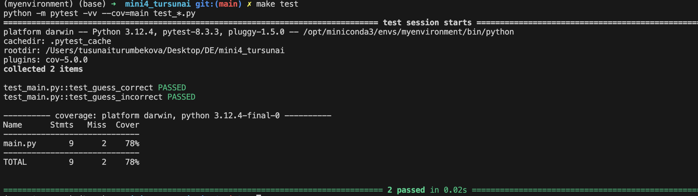
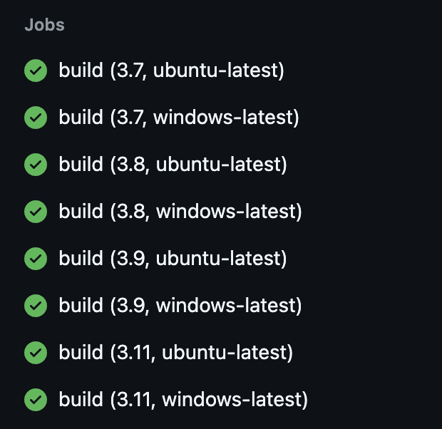

# Mini4_Tursunai

This project demonstrates how to set up a **GitHub Actions workflow** for a Python project. The workflow tests the code across multiple Python versions using a matrix build, ensuring compatibility across different environments.

## Features:
- Set up **GitHub Actions** for Continuous Integration (CI)
- Tested across Python versions **3.7, 3.8, 3.9, and 3.11**
- Includes basic Python scripts and unit tests
- Automatic code formatting with `black`

## Workflow
The project includes a GitHub Actions configuration that runs tests and formats code for multiple Python versions on both **Ubuntu** and **Windows**.

### Steps:
1. **Install dependencies**: Runs `make install`
2. **Lint the code**: Runs `make lint` 
   

3. **Run tests**: Executes `pytest` on various Python versions
   

4. **Format code**: Ensures code is formatted with `black`

### Workflow Configuration:
The matrix build runs on the following configurations:
- Python versions: 3.7, 3.8, 3.9, 3.11
- Operating systems: Ubuntu, Windows

## Example of CI Run:
Here is a screenshot of a successful workflow execution:



## Installation and Usage

To install the required packages and run the tests locally:

```bash
pip install -r requirements.txt
make test
